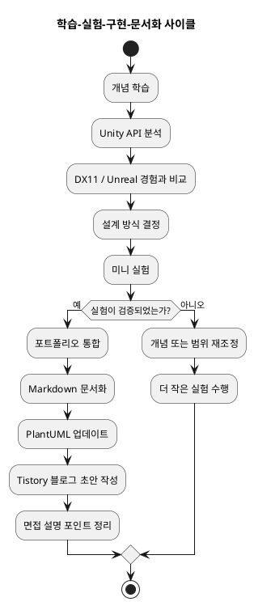
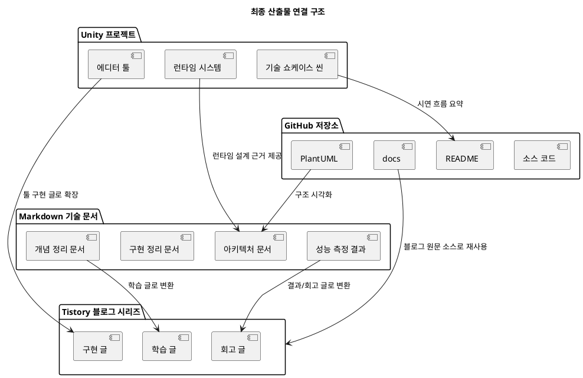

# Important MVP Scope Update

The full direction is valid, but the first release must be narrowed.

## MVP 1

- Modular Skill System
- Skill Editor
- Technical Showcase Scene
- Markdown Docs
- PlantUML

## MVP 2

- Animation Tool
- Animation Event and Skill integration
- Shader Showcase

## MVP 3

- Optimization Showcase
- Rendering Debug View
- Tistory Blog Series polish

Rule:

Do not try to complete every planned system at once. The first complete portfolio milestone is `Modular Skill System + Skill Editor + Technical Showcase Scene`.

Each feature must use this folder template:

```text
<feature-name>/
  00_README.md
  01_Concept.md
  02_MiniExperiment.md
  03_Architecture.md
  04_Implementation.md
  05_BlogDraft.md
  06_Interview.md
  07_BeforeAfter.md
  uml/
```

Every feature must include Before / After proof.

---
# Unity Technical Showcase Portfolio Study Master Plan

이 문서는 GPT에게 전달하기 위한 단일 마스터 문서다. 목적은 Unity 포트폴리오를 만들면서 어떤 개념을 어떤 순서로 공부하고, 어떤 미니 실험을 거쳐, 어떻게 구현/문서화/블로그화할지 요약하는 것이다.

## 1. Portfolio Goal

이 포트폴리오는 단순히 게임 하나를 만드는 프로젝트가 아니다.

목표는 다음을 증명하는 것이다.

- 어떤 개념을 공부했는가
- 왜 그 개념이 필요한가
- Unity에서 어떻게 적용했는가
- 기존 DX11 / Unreal 경험과 어떻게 연결되는가
- 어떤 문제를 해결했는가
- 어떤 구조로 확장 가능하게 설계했는가
- 면접에서 기술적으로 설명 가능한 결과물을 만들었는가

최종 형태는 `Unity Technical Showcase`다.

핵심 구성:

- Modular Skill System
- Skill Editor
- Animation Tool
- Shader Showcase
- Optimization Showcase
- Rendering Debug View
- Technical Showcase Scene
- GitHub docs + PlantUML + Tistory blog series

## 2. Final Connected Outputs

최종 산출물은 4개가 서로 연결되어야 한다.

1. Unity Project
   - 실제 동작하는 기술 포트폴리오
   - 하나의 Showcase Scene에서 주요 기능 확인

2. GitHub Repository
   - 소스 코드
   - README
   - docs
   - PlantUML
   - 개발 로드맵

3. Markdown Technical Docs
   - 기능별 개념 정리
   - 설계 문서
   - UML
   - 문제 해결 과정
   - 개선 방향

4. Tistory Blog Series
   - 공부한 개념
   - Unity 적용 방식
   - DX11 / Unreal 비교
   - 구현 이유
   - 결과와 회고

## 3. Required Cycle For Every Feature

각 기능은 반드시 아래 순서로 진행한다.

```text
Concept Study
-> Mini Experiment
-> Portfolio Integration
-> Documentation
-> Tistory Blog Draft
-> Interview Summary
```

### Step 1. Concept Study

구현 전에 이론을 정리한다.

질문:

- 이 기능은 왜 필요한가?
- Unity에서는 어떤 API를 사용하는가?
- DX11 / Unreal에서는 어떻게 처리했는가?
- 실무에서는 어떤 문제가 발생하는가?
- 어떤 설계 패턴이 적합한가?

산출물:

- 공부해야 할 개념 목록
- 개념별 설명
- Unity API 분석
- DX11 / Unreal 비교
- 설계 방식 결정

### Step 2. Mini Experiment

메인 포트폴리오에 바로 넣지 않는다. 작은 테스트 씬에서 먼저 검증한다.

예시:

- ScriptableObject로 스킬 데이터 하나 만들기
- RenderTexture로 카메라 화면 출력하기
- LOD 적용 전후 비교하기
- Shader 하나만 단독 구현하기
- PlayableGraph로 AnimationClip 하나 재생하기

산출물:

- 테스트 씬
- 최소 구현 코드
- 스크린샷/GIF
- 성공/실패 기록

### Step 3. Portfolio Integration

검증된 기능만 메인 Showcase Project에 통합한다.

확인할 것:

- 모듈 간 의존성
- Assembly Definition 구조
- 인터페이스 분리
- 데이터 구조
- 확장 가능성
- 성능 영향
- Debug UI 노출 여부

산출물:

- 통합된 Runtime 기능
- Editor 또는 Debug Control
- Demo Scene 상호작용

### Step 4. Documentation

구현이 끝난 기능은 GitHub docs 폴더에 Markdown으로 정리한다.

포함할 내용:

- 개념 정리
- 설계 의도
- UML
- 핵심 코드 구조
- 문제 해결 과정
- 성능 측정 결과
- 개선 방향

### Step 5. Tistory Blog Draft

Markdown 문서를 기반으로 Tistory 글 초안을 작성한다.

글 구조:

1. 이 개념을 공부한 이유
2. 개념 설명
3. Unity에서의 적용 방식
4. 기존 DX11 / Unreal 경험과의 비교
5. 실제 구현 구조
6. 문제 상황과 해결 과정
7. 결과
8. 느낀 점 및 개선 방향

### Step 6. Interview Summary

각 기능마다 면접에서 설명할 핵심 포인트를 만든다.

포함할 내용:

- 3줄 요약
- 구조 설명
- 트레이드오프
- 실패/한계
- 개선 방향

## 4. System Study Plan

## 4.1 Skill System

### Study Concepts

- Modular Architecture
- SOLID Principles
- Strategy Pattern
- Command Pattern
- Factory Pattern
- Data Driven Design
- ScriptableObject
- Runtime Skill Assembly
- Cooldown System
- Targeting System
- Condition System
- Effect Pipeline

### Unity Application

- `SkillDefinitionSO`를 데이터 원본으로 둔다.
- `EffectDefinitionSO`, `TargetingDefinitionSO`, `CooldownDefinitionSO`, `ConditionDefinitionSO`로 모듈을 분리한다.
- Runtime에서는 ScriptableObject를 직접 실행하지 않고 `SkillFactory`가 `SkillInstance`로 조립한다.
- `SkillController`는 입력/AI 요청을 받고 SkillInstance 실행만 담당한다.

### DX11 / Unreal Comparison

- DX11의 Prototype Manager와 Clone 구조는 Unity의 ScriptableObject + Factory + Runtime Instance 구조와 연결된다.
- Unreal GAS와 비교하면, 이 프로젝트는 GAS의 핵심 아이디어를 Unity에서 직접 축소 구현하는 방향이다.

### Mini Experiments

- ScriptableObject 기반 단일 스킬 생성
- Target Resolver 하나 구현
- Effect Module 하나 구현
- Cooldown UI 표시
- Runtime Skill Assembly 로그 출력

### Blog Draft Topics

- 모듈형 스킬 시스템을 설계하는 이유
- ScriptableObject 기반 스킬 데이터 설계
- Effect / Target / Condition 분리 설계
- 런타임 스킬 조립 구조 만들기

### Interview Points

- 스킬을 상속 구조가 아니라 모듈 조립으로 설계한 이유
- ScriptableObject와 Runtime Instance를 분리한 이유
- Target, Condition, Effect 분리가 확장성에 주는 이점

## 4.2 Skill Editor

### Study Concepts

- Unity Editor Scripting
- Custom Editor
- EditorWindow
- SerializedObject
- SerializedProperty
- Odin 없이 Tool 만들기
- Graph View 또는 Node Editor 구조
- Asset Save / Load
- Validation System

### Unity Application

- `EditorWindow`로 스킬 생성/편집/검증/프리뷰를 제공한다.
- `SerializedObject`와 `SerializedProperty`로 Undo와 Unity Inspector 연동성을 확보한다.
- 초기 버전은 Graph View보다 Module Stack UI로 구현한다.

### DX11 / Unreal Comparison

- DX11 Animation Tool의 ImGui 기반 툴 제작 경험을 Unity EditorWindow로 이전한다.
- Unreal Editor Utility Widget과 비교해 Unity는 C# 기반 Editor 확장이 빠르다.

### Mini Experiments

- SkillDefinitionSO 생성 버튼
- SerializedProperty로 Effect 리스트 편집
- Validation 메시지 출력
- AssetDatabase 저장/로드

### Blog Draft Topics

- Unity EditorWindow로 스킬 툴 만들기
- 스킬 데이터 검증 시스템 설계
- 기획자가 사용할 수 있는 Tool UX 설계

### Interview Points

- Runtime Assembly와 Editor Assembly를 분리한 이유
- Validation System이 실무에서 중요한 이유
- Odin 없이 Unity 기본 API로 툴을 만든 이유

## 4.3 Animation Tool

### Study Concepts

- Skeletal Animation
- Bone Hierarchy
- Local / World Transform
- Matrix
- Quaternion
- Keyframe
- Animation Clip
- Animation Event
- Animation Blending
- Mecanim
- Playables API
- Animation Rigging
- Timeline 구조

### Unity Application

- 일반 캐릭터 제어는 Animator/Mecanim을 사용한다.
- Tool Preview와 Clip Blend는 Playables API를 사용한다.
- Bone Viewer는 SceneView Gizmo로 구현한다.
- Animation Event는 Skill Event와 연결한다.

### DX11 / Unreal Comparison

- DX11의 `CModel -> CAnimation -> CChannel -> CBone` 구조를 Unity의 `AnimationClip -> Binding/Curve -> Transform` 구조와 비교한다.
- Unreal Montage/Notify와 Unity Animation Event/Playable을 비교한다.

### Mini Experiments

- PlayableGraph로 AnimationClip 재생
- 두 AnimationClip Blend
- SceneView Bone Gizmo 표시
- Animation Event Marker 데이터 생성

### Blog Draft Topics

- DX11에서 구현했던 애니메이션 시스템을 Unity로 옮기기
- Bone Transform과 Quaternion 정리
- Runtime Animation Preview Tool 만들기
- Animation Event와 Skill 연동 구조

### Interview Points

- Mecanim과 Playables API 차이
- Quaternion이 필요한 이유
- Animation Event와 Skill System을 느슨하게 연결하는 방식

## 4.4 Shader Showcase

### Study Concepts

- Unity ShaderLab
- HLSL
- URP Shader 구조
- Vertex Shader
- Fragment Shader
- Normal
- Tangent Space
- Fresnel
- Rim Light
- Dissolve
- Outline
- Toon Shading
- Render Queue
- Depth
- Stencil
- GrabPass 대체 방식
- Shader Variant
- SRP Batcher 대응

### Unity Application

- URP ShaderGraph와 HLSL Custom Function을 병행한다.
- GrabPass는 URP에서 직접 쓰기 어렵기 때문에 Opaque Texture, Camera Color Texture, RendererFeature 대체 방식을 학습한다.
- SRP Batcher 대응을 위해 CBUFFER와 Material property 구조를 주의한다.

### DX11 / Unreal Comparison

- DX11 HLSL 경험을 Unity ShaderLab/HLSL 구조로 옮긴다.
- Unreal Material Graph와 Unity ShaderGraph의 장단점을 비교한다.

### Mini Experiments

- Fresnel Shader 단독 구현
- Dissolve Shader 단독 구현
- Outline 방식 2개 비교
- Render Queue / Depth / Stencil 실험

### Blog Draft Topics

- Unity URP Shader 구조 정리
- Fresnel / Rim Light 원리와 구현
- Dissolve Shader 구현
- Outline Shader 구현 방식 비교
- SRP Batcher 친화적인 Shader 작성법

### Interview Points

- Vertex/Fragment 단계 구분
- Depth, Stencil, Render Queue가 결과에 미치는 영향
- SRP Batcher 친화적인 Shader 작성 방식

## 4.5 Optimization Showcase

### Study Concepts

- Unity Profiler
- Frame Debugger
- Rendering Statistics
- CPU Bottleneck
- GPU Bottleneck
- Draw Call
- Batching
- GPU Instancing
- SRP Batcher
- LOD Group
- Frustum Culling
- Occlusion Culling
- Object Pooling
- Addressables
- Async Loading
- Memory Profiler

### Unity Application

- 최적화는 적용보다 측정이 먼저다.
- Profiler, Frame Debugger, Rendering Stats로 병목을 분류한다.
- Object Pooling, Addressables, LOD, Culling은 ON/OFF 비교가 가능해야 한다.

### DX11 / Unreal Comparison

- DX11에서는 Draw Call, RenderTarget, Frustum, Alpha sorting을 직접 다뤘다.
- Unity에서는 엔진이 많은 것을 처리하지만, Profiler로 원인을 분석하고 설정을 제어하는 능력이 중요하다.

### Mini Experiments

- Projectile 500개 Pooling ON/OFF 비교
- 동일 Mesh 1000개 GPU Instancing 비교
- LOD 적용 전후 비교
- Addressables async load 실험

### Blog Draft Topics

- Unity Profiler로 병목 지점 찾기
- Draw Call과 Batching 정리
- LOD / Culling 최적화 실험
- Object Pooling 적용 전후 비교
- Addressables와 비동기 로딩 구조

### Interview Points

- CPU 병목과 GPU 병목 구분법
- Draw Call과 SetPass Call 의미
- Pooling이 GC와 프레임 스파이크에 주는 영향

## 4.6 Rendering Debug View

### Study Concepts

- Camera
- RenderTexture
- Multi Camera Rendering
- CommandBuffer
- Replacement Shader
- Depth Texture
- Normal Texture
- Wireframe View
- Overdraw View
- Debug View
- Post Processing

### Unity Application

- RenderTexture로 카메라 출력과 디버그 뷰를 UI에 연결한다.
- URP Camera Stacking, RendererFeature, CommandBuffer를 조합한다.
- Normal/Depth Debug View는 렌더링 이해도를 보여주는 핵심 장치다.

### DX11 / Unreal Comparison

- DX11의 MRT Debug RTV 구조를 Unity RenderTexture 멀티뷰로 이식한다.
- Unreal Buffer Visualization과 유사한 기능을 Unity에서 직접 구성한다.

### Mini Experiments

- RenderTexture로 카메라 화면 출력
- Depth Texture 표시
- Normal Debug Shader 출력
- Multi Camera View 구성

### Blog Draft Topics

- RenderTexture 기반 멀티뷰 디버거 만들기
- Unity에서 Normal / Depth Debug View 만들기
- 여러 카메라를 이용한 기술 시연 화면 구성

### Interview Points

- RenderTexture를 사용하는 이유
- Depth/Normal Texture가 후처리와 디버깅에 필요한 이유
- Debug View가 렌더링 문제 분석에 주는 가치

## 5. Technical Blog Roadmap

### Stage 1. Foundation Design

1. Unity 기술 포트폴리오를 왜 게임이 아니라 시스템 쇼케이스로 만들었는가
2. Assembly Definition 기반 모듈화 설계
3. ScriptableObject와 Data Driven Design 정리
4. SOLID 원칙을 Unity 프로젝트에 적용하기

### Stage 2. Skill System

1. 모듈형 Skill System 구조 설계
2. Effect / Target / Condition 분리하기
3. Runtime Skill Assembly 구현
4. Skill EditorWindow 제작
5. Skill Validation System 만들기

### Stage 3. Animation System

1. Skeletal Animation 구조 정리
2. Bone Hierarchy와 Transform 계산
3. Quaternion과 Animation Blending 정리
4. Unity Playables API로 Animation Preview 구현
5. Animation Event와 Skill System 연동

### Stage 4. Shader

1. Unity URP Shader 구조 정리
2. Fresnel / Rim Light 구현
3. Dissolve Shader 구현
4. Outline Shader 구현 방식 비교
5. Shader Variant와 SRP Batcher 최적화

### Stage 5. Optimization

1. Unity Profiler로 병목 찾기
2. Draw Call과 Batching 정리
3. LOD / Culling 최적화 실험
4. Object Pooling 적용 전후 비교
5. Addressables 기반 비동기 로딩

### Stage 6. Rendering Debugger

1. RenderTexture 기반 Multi View 구성
2. Depth / Normal Debug View 만들기
3. Frame Debugger를 활용한 렌더링 분석
4. 포트폴리오용 Technical Showcase Scene 구성

## 6. PlantUML Diagrams

### Learning Cycle



### Final Output Structure



## 7. GPT Request Prompt

아래 프롬프트로 GPT에게 넘기면 된다.

```text
이 문서를 기준으로 Unity Technical Showcase 포트폴리오를 만들면서 어떤 순서로 공부하고, 어떤 미니 실험을 하고, 어떤 기능을 구현하고, 어떤 Markdown 문서와 Tistory 블로그 글을 작성해야 하는지 실행 가능한 학습/개발 계획으로 요약해줘.

조건:
- 나는 Unity 숙련도가 아직 부족하다.
- DX11 자체 엔진, Animation Tool, Unreal 경험은 있다.
- 목표는 단순 게임 제작이 아니라 2~5년차 클라이언트 개발자로서 기술 수준을 보여주는 포트폴리오다.
- 각 기능마다 공부할 개념, 미니 실험, 구현 계획, 문서화 계획, 블로그 글 주제, 면접 설명 포인트를 정리해줘.
- 전체 개발 기간과 주간 워크플로우도 현실적으로 제안해줘.
```


# 추가 지침: Feature Toggle와 Before/After RenderTarget 비교

Unity Technical Showcase의 모든 기능은 `IFeatureModule` 기반 독립 모듈로 관리한다. 각 기능은 `FeatureToggleManager`에서 ON/OFF 가능해야 하며, `ComparisonViewSystem`을 통해 적용 전과 후를 RenderTexture로 비교한다.

## 공통 모듈 책임

- Initialize
- Enable
- Disable
- Reset
- Tick
- Capture Before State
- Capture After State
- Provide Debug UI Data
- Provide Performance Metrics

## 포트폴리오 시연 중심 구조

- `ShowcaseControlPanel`: 모든 기능 조작 UI
- `FeatureToggleManager`: 모듈 등록, 토글, 의존성, 상태 관리
- `ComparisonViewSystem`: Before/After RenderTexture 비교
- `ModuleMetricsProvider`: FPS, GC, Draw Call, 실행 시간 등 지표 수집
- `MetricsView`: 수치 변화 표시

## 인프런 스킬 시스템 강의 적용 규칙

강의 구조를 그대로 복사하지 않는다. 강의는 모듈형 스킬 시스템, ScriptableObject 데이터 설계, Effect/Target/Condition/Cooldown 분리, Runtime Skill Assembly를 학습하기 위한 참고 자료다.

최종 구조는 다음처럼 변환한다.

```text
강의 Skill System -> SkillSystemModule
강의 Skill Editor -> SkillEditorModule
강의 Skill Data -> SkillDefinitionSO / EffectDefinitionSO / TargetingDefinitionSO / ConditionDefinitionSO
강의 Runtime Skill -> SkillInstance / SkillFactory / SkillController
강의 Tool UI -> ShowcaseControlPanel + SkillEditorPanel
강의 Debug 출력 -> ModuleMetricsProvider + MetricsView + SkillEventTimeline
강의 단일 실행 화면 -> Before / After RenderTarget Comparison View
```

## GPT 피드백 요청 시 확인할 질문

1. 이 MVP 범위가 현실적인가?
2. Feature Module 구조가 Unity 프로젝트에 과하게 복잡하지 않은가?
3. Before/After RenderTexture 비교가 면접 시연에 충분히 설득력 있는가?
4. Skill System과 Skill Editor를 MVP 1순위로 둔 판단이 적절한가?
5. 인프런 강의 구조를 포트폴리오 구조로 재설계하는 방향이 타당한가?
6. 문서, PlantUML, 블로그, 면접 설명 흐름이 하나로 연결되는가?

# 추가 지침: 학습 기반 포트폴리오 개발 강제 규칙

포트폴리오의 목표는 “Unity 기능 구현”이 아니라 “기술적으로 설명 가능한 개발 과정 자체를 포트폴리오화”하는 것이다.

각 기능은 반드시 아래 산출물을 남긴다.

- Source Code
- Git Commit
- Markdown
- PlantUML
- Tistory Blog Draft
- Notion Development Journal
- Interview Notes

기능 완료 기준은 구현 완료가 아니다. Concept Study, Architecture Design, Mini Experiment, Implementation, Verification, Git Commit, Markdown Documentation, PlantUML Update, Tistory Blog Draft, Notion Development Journal, Interview Notes가 모두 끝나야 완료로 본다.

Codex는 매 작업마다 다음을 정리해야 한다.

- 이번 작업에서 배운 개념
- 강의 구조와 우리 구조의 차이
- 변경 이유
- 모듈화 포인트
- 확장성 포인트
- 차별화 포인트
- 블로그로 작성 가능한 내용
- 면접에서 설명할 수 있는 내용

# 추가 지침: KPI / Backlog / Risk / Recruiter Mode

앞으로 Codex는 기능을 만들기 전에 다음을 먼저 확인한다.

1. 이 기능은 Backlog의 Must / Should / Could / Won't 중 어디에 속하는가?
2. 이 기능의 KPI Level 1~5는 무엇인가?
3. 이 기능의 Risk는 무엇인가?
4. 이 기능은 DX11 / Unreal 경험과 어떻게 연결되는가?
5. 이 기능은 어떤 30초 GIF 또는 3분 시연 영상으로 보여줄 수 있는가?
6. 이 기능의 Recruiter Summary는 무엇인가?
7. 이 기능이 일반 Unity 포트폴리오와 비교해서 어떤 차별성을 만드는가?

최상위 규칙:

```text
이 기능이 일반 Unity 포트폴리오와 비교해서 어떤 차별성을 만들고 있는가?
```

이 질문에 답하지 못하면 기능을 추가하지 않는다.

# 추가 지침: NY Modular Portfolio Framework / Naming Governance

최종 구조는 `NY Core Framework -> NY Module Hub -> Category Modules -> Feature Modules -> Tool Modules -> Before/After Comparison -> Metrics -> Docs/Blog/Interview Notes`를 따른다.

최종 네이밍 규칙은 `NY_Category_Role`이다.

Codex는 새 클래스를 만들기 전에 다음 문서를 반드시 확인한다.

- `docs/conventions/NamingConvention.md`
- `docs/conventions/FolderConvention.md`
- `docs/conventions/AssemblyConvention.md`
- `projects/unity-technical-showcase/framework/ModuleGovernanceSystem.md`

새로운 기능을 추가하기 전에는 Architecture Governance Report를 먼저 작성한다.

필수 검토 항목: Backlog 위치, KPI Level, ModuleHub 등록 가능 여부, Assembly 영향, 기존 Feature와 결합도, Before/After 가능성, Metrics 가능성, Blog/Interview 가치, 승인 또는 보류 판단.
