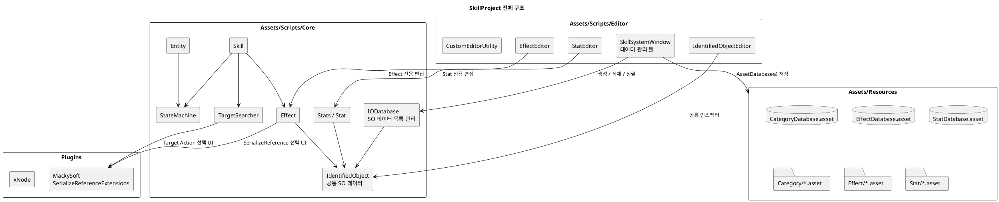
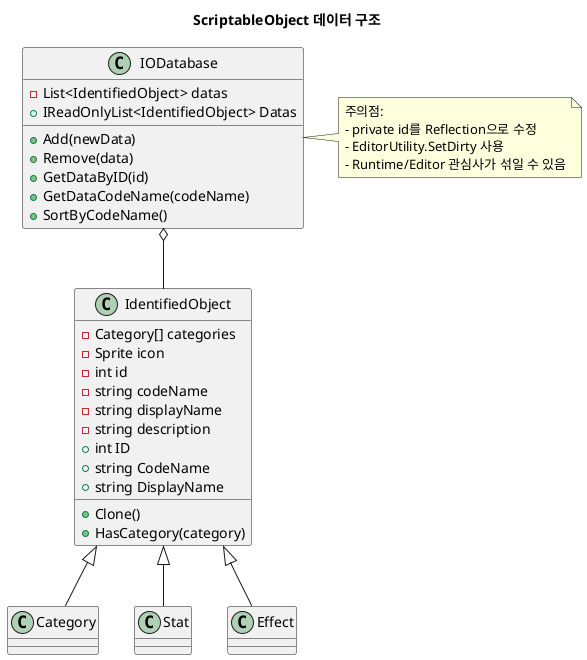
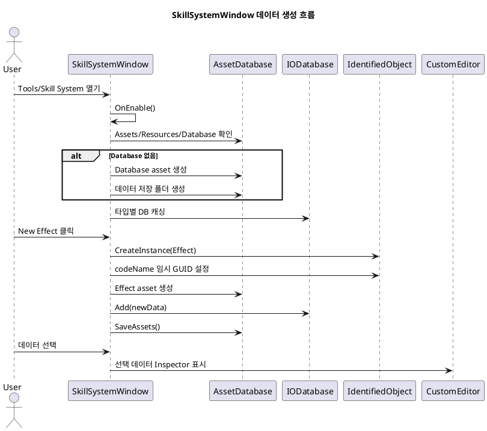
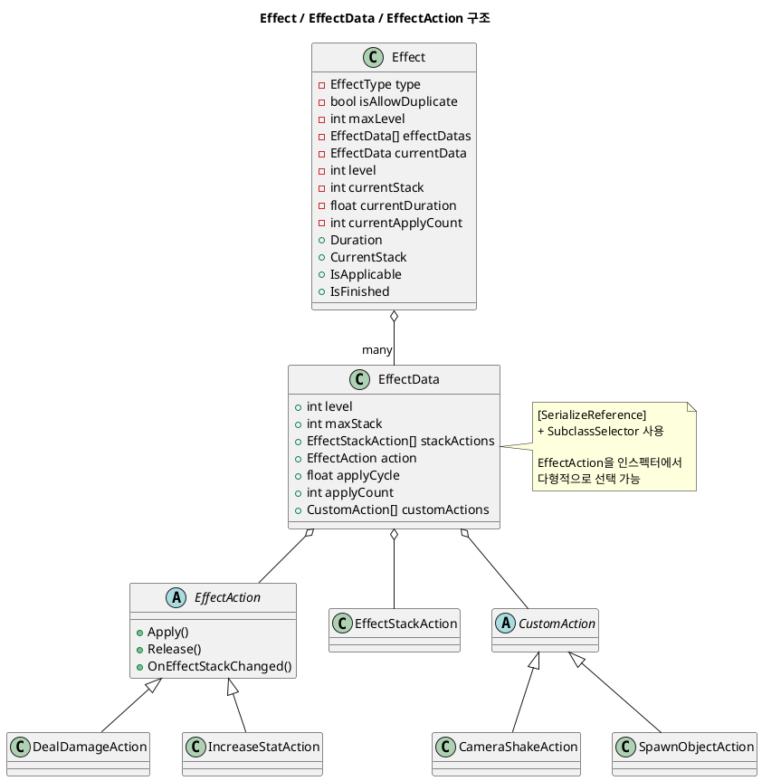
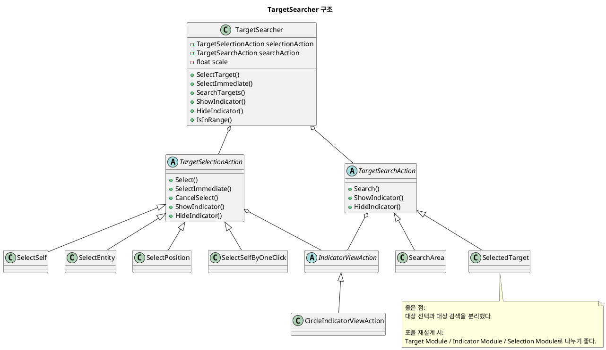
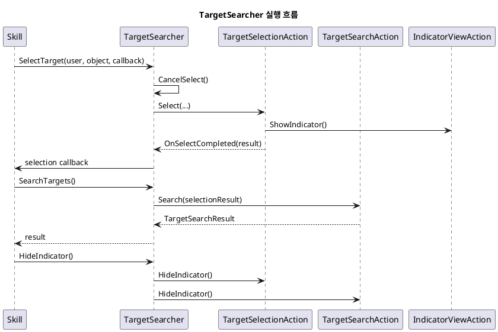
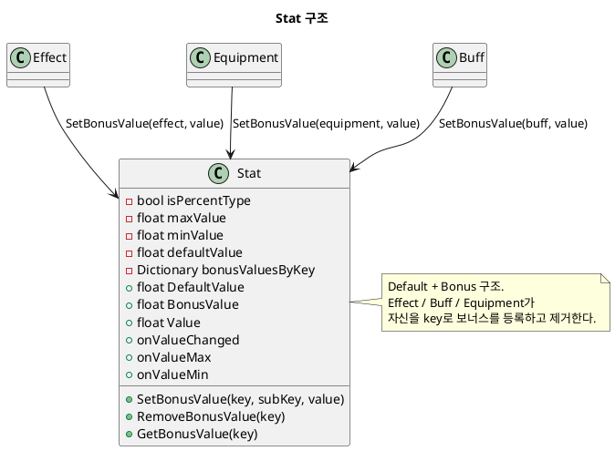

# SkillProject Learning Review

이 문서는 `C:\kny\Project\Unity\SkillProject`를 다시 이어서 학습하기 위한 복습용 구조 분석 문서다.

목표는 코드를 완벽하게 평가하는 것이 아니라, 스킬툴을 다시 진행하기 전에 전체 구조를 빠르게 떠올리는 것이다.

## 1. 지금 프로젝트를 한 문장으로 보면

`SkillProject`는 인프런 모듈식 스킬 시스템 강의를 따라가며 만든 Unity 스킬 시스템 학습 프로젝트다.

핵심은 다음이다.

```text
ScriptableObject 데이터
+ EditorWindow 데이터 관리 툴
+ Effect / Target / Stat / Category 분리
+ StateMachine 기반 Skill / Entity 흐름 실험
```

단, 아직 완성된 포트폴리오 구조는 아니다.

일부 클래스는 빈 MonoBehaviour이고, Runtime / Editor 관심사가 섞인 부분도 있다.

## 2. 전체 폴더 구조

```text
SkillProject/
├─ Assets/
│  ├─ Plugins/
│  │  ├─ MackySoft.SerializeReferenceExtensions/
│  │  └─ xNode/
│  ├─ Prefabs/
│  ├─ Resources/
│  ├─ Scenes/
│  └─ Scripts/
│     ├─ Core/
│     ├─ Editor/
│     └─ Test/
├─ Packages/
└─ ProjectSettings/
```

학습할 때 가장 많이 볼 곳은 아래 3개다.

```text
Assets/Scripts/Core
Assets/Scripts/Editor
Assets/Resources
```

## 3. 전체 구조 UML



## 4. 가장 중요한 데이터 구조

현재 데이터의 기반은 `IdentifiedObject`다.

`Category`, `Stat`, `Effect` 같은 데이터가 `IdentifiedObject`를 상속한다.

```text
IdentifiedObject
├─ Category
├─ Stat
└─ Effect
```

`IODatabase`는 이런 `IdentifiedObject` 목록을 들고 있는 ScriptableObject다.

```text
CategoryDatabase.asset → Category asset 목록
StatDatabase.asset     → Stat asset 목록
EffectDatabase.asset   → Effect asset 목록
```

## 5. 데이터 구조 UML



## 6. SkillSystemWindow가 하는 일

`SkillSystemWindow`는 현재 가장 중요한 스킬툴 코드다.

파일:

```text
Assets/Scripts/Editor/SkillSystemWindow.cs
```

메뉴:

```text
Tools > Skill System
```

현재 관리하는 데이터 타입:

```csharp
SetupDatabases(new[] { typeof(Category), typeof(Stat), typeof(Effect) });
```

즉 현재 이름은 Skill System이지만, 실제로는 `Category / Stat / Effect` 데이터베이스 관리 툴에 가깝다.

### SkillSystemWindow 동작 흐름

1. `OnEnable()`에서 스타일과 데이터베이스를 준비한다.
2. `Assets/Resources/Database` 폴더가 없으면 만든다.
3. 타입별 Database asset을 찾는다.
4. 없으면 새로 만든다.
5. `New Category`, `New Stat`, `New Effect` 버튼으로 데이터 asset을 만든다.
6. 만든 데이터를 IODatabase에 추가한다.
7. 선택된 데이터는 CustomEditor로 오른쪽에 보여준다.

## 7. EditorWindow 흐름 UML



## 8. Effect 구조 이해

`Effect`는 현재 프로젝트에서 가장 구조가 많이 들어간 클래스다.

파일:

```text
Assets/Scripts/Core/Effect/Effect.cs
Assets/Scripts/Core/Effect/EffectData.cs
Assets/Scripts/Core/Effect/EffectAction/*.cs
```

Effect가 들고 있는 주요 개념:

```text
Effect Type
중복 허용 여부
UI 표시 여부
Level
Stack
Duration
Apply Count
Apply Cycle
EffectAction
CustomAction
StackAction
```

중요한 점은 `EffectData` 안에 실제 동작 모듈이 들어간다는 것이다.

```csharp
[SerializeReference, SubclassSelector]
public EffectAction action;
```

즉 `Effect`는 데이터 컨테이너이고, 실제 동작은 `EffectAction` 파생 클래스가 담당한다.

예시:

```text
DealDamageAction
IncreaseStatAction
```

## 9. Effect 구조 UML



## 10. TargetSearcher 구조 이해

`TargetSearcher`는 스킬 대상 선택 구조다.

파일:

```text
Assets/Scripts/Core/TargetSearcher/TargetSearcher.cs
```

핵심은 두 단계를 분리한 것이다.

```text
1. TargetSelectionAction
   → 기준점 선택

2. TargetSearchAction
   → 기준점을 기준으로 실제 대상 검색
```

예시:

```text
SelectSelf
SelectEntity
SelectPosition
SelectSelfByOneClick

SearchArea
SelectedTarget
```

또한 Indicator 표시도 분리되어 있다.

```text
IndicatorViewAction
CircleIndicatorViewAction
```

## 11. TargetSearcher UML



## 12. TargetSearcher 실행 흐름 UML



## 13. Stat 구조 이해

`Stat`은 캐릭터 수치 데이터다.

파일:

```text
Assets/Scripts/Core/Stats/Stat.cs
```

핵심 개념:

```text
DefaultValue
BonusValue
Value = Default + Bonus
MinValue / MaxValue
ValueChanged Event
```

보너스 구조가 중요하다.

```text
Dictionary<object, Dictionary<object, float>> bonusValuesByKey
```

의미:

```text
장비 / 버프 / 효과 같은 source별로 보너스 값을 넣고 제거할 수 있다.
```

예를 들어 Effect가 공격력 증가를 걸면:

```text
STAT_DAMAGE.SetBonusValue(effect, value)
```

Effect가 끝나면:

```text
STAT_DAMAGE.RemoveBonusValue(effect)
```

## 14. Stat UML



## 15. 지금 기억해야 할 핵심 개념 5개

### 1. IdentifiedObject

모든 데이터의 공통 부모다.

```text
id / codeName / displayName / description / icon / category
```

포트폴리오에서는 `DefinitionBase` 같은 이름으로 바꿀 수 있다.

### 2. IODatabase

ScriptableObject 데이터 목록을 들고 있는 Database다.

EditorWindow에서 데이터 생성 / 삭제 / 정렬을 할 때 사용한다.

포트폴리오에서는 Runtime과 Editor 관심사를 분리해야 한다.

### 3. EffectAction

Effect의 실제 동작을 담당하는 모듈이다.

```text
Effect = 데이터와 실행 상태
EffectAction = 실제 효과
```

포트폴리오의 `Effect / Condition / Target 분리` 설계에 가장 직접적으로 연결된다.

### 4. TargetSearcher

대상 선택과 대상 검색을 분리한다.

```text
SelectionAction = 어디를 기준으로 할지
SearchAction = 그 기준에서 누구를 찾을지
```

포트폴리오에서 Target System을 설계할 때 핵심 참고 구조다.

### 5. SkillSystemWindow

ScriptableObject 데이터를 만들고 관리하는 EditorWindow다.

현재는 Category / Stat / Effect만 관리하지만, 포트폴리오에서는 SkillDefinition까지 관리하도록 확장할 수 있다.

## 16. 현재 프로젝트의 강점

```text
1. ScriptableObject 기반 데이터 관리 구조가 있다.
2. EditorWindow로 데이터 생성 / 삭제 / 정렬을 한다.
3. SerializeReference로 다형성 EffectAction을 구성한다.
4. Target Selection / Search를 분리했다.
5. Stat / Effect / Category가 데이터로 분리되어 있다.
6. Skill UI Prefab과 테스트 씬이 있다.
```

## 17. 현재 프로젝트의 약점

```text
1. Skill.cs / SkillData.cs / SkillSystem.cs는 아직 빈 MonoBehaviour다.
2. 일부 SkillStateMachine 계열도 빈 껍데기다.
3. Resources 의존이 강하다.
4. Runtime 코드와 Editor 코드 관심사가 섞여 있다.
5. Reflection으로 id를 수정한다.
6. asmdef가 없다.
7. namespace가 없다.
8. xNode가 실제 스킬툴에 쓰이는지 불명확하다.
```

## 18. 다시 학습할 때 보는 순서

스킬툴을 다시 진행할 때는 아래 순서로 보면 된다.

```text
1. IdentifiedObject.cs
2. IODatabase.cs
3. SkillSystemWindow.cs
4. Category / Stat / Effect asset 구조
5. Effect.cs
6. EffectData.cs
7. EffectAction 계열
8. TargetSearcher.cs
9. TargetSelectionAction 계열
10. TargetSearchAction 계열
11. Entity StateMachine
12. Skill StateMachine
```

처음부터 Skill.cs를 보면 안 된다.

현재 `Skill.cs`, `SkillData.cs`, `SkillSystem.cs`는 이름은 중요해 보이지만 아직 빈 상태라 학습 출발점으로 부적합하다.

## 19. TechShowcase에 가져갈 때 변환 방향

```text
SkillProject 구조
→ TechShowcase 구조
```

```text
IdentifiedObject
→ NY_Data_DefinitionBase

IODatabase
→ NY_Data_Database<T>

SkillSystemWindow
→ NY_SkillEditor_Window

EffectAction
→ NY_Skill_EffectAction

TargetSearcher
→ NY_Skill_TargetingModule

Stat
→ NY_Stat_Definition / NY_Stat_Runtime
```

## 20. 지금 결론

현재 프로젝트는 완성형 포트폴리오가 아니라 학습용 실험 프로젝트다.

하지만 아래 개념은 포트폴리오에 가져갈 가치가 크다.

```text
ScriptableObject Database
EditorWindow Database Tool
SerializeReference EffectAction
TargetSearcher 분리 구조
Stat / Category / Effect 데이터 분리
```

앞으로 할 일:

```text
1. SkillProject에서 인강을 끝까지 듣는다.
2. 위 구조를 다시 보며 어떤 개념을 배웠는지 기록한다.
3. 강의 완료 후 전체 구조를 다시 분석한다.
4. TechShowcase에는 그대로 복사하지 않고 재설계해서 넣는다.
```
