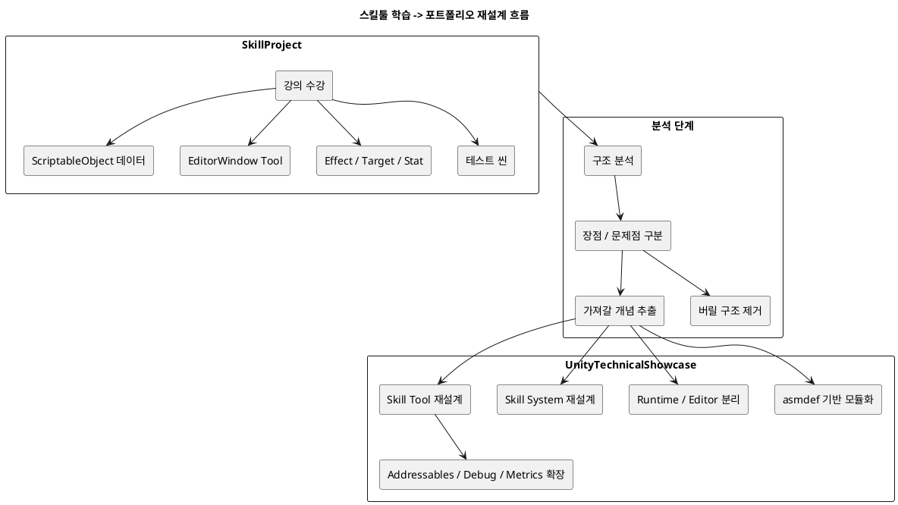
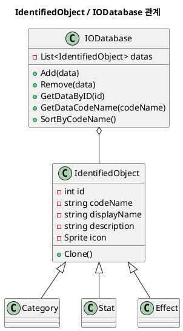
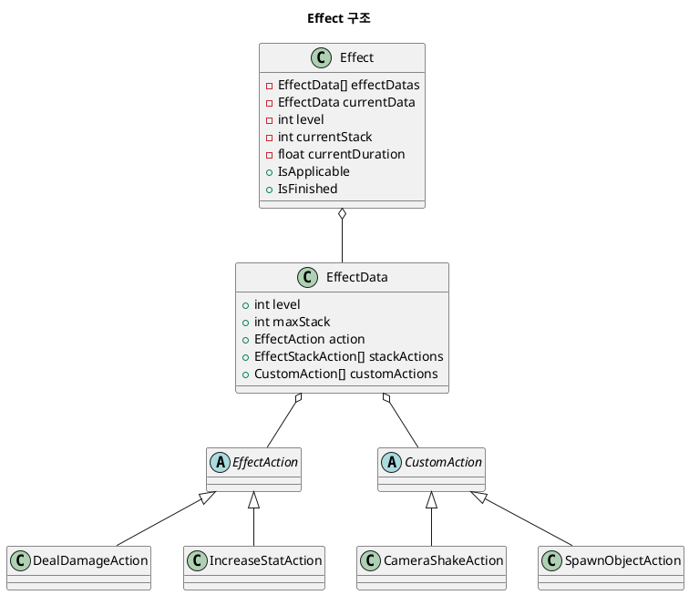
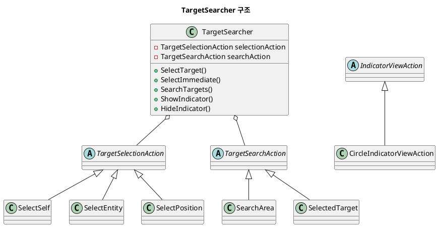

# Skill Tool Concept Study Map

이 문서는 `C:\kny\Project\Unity\SkillProject`를 다시 학습하면서 알아야 할 Unity / C# / Tool / Skill System 개념을 정리한 문서다.

목적은 강의 코드를 그냥 따라치는 것이 아니라, 어떤 개념을 공부하고 있는지 이해한 뒤 `UnityTechnicalShowcase`에 재설계해서 적용하는 것이다.

## 현재 학습 위치

```text
학습 프로젝트: C:\kny\Project\Unity\SkillProject
최종 포트폴리오: C:\kny\Project\Unity\UnityTechnicalShowcase
문서 기준: md-docs / projects/skill-project
```

현재 `SkillProject`는 인프런 모듈식 스킬 시스템 강의를 따라가며 만든 학습 프로젝트다.

중요한 점:

```text
SkillProject = 학습 / 실험
UnityTechnicalShowcase = 분석 후 재설계할 포트폴리오
```

## 전체 학습 흐름



## 1. ScriptableObject

### 왜 공부해야 하나

스킬, 스탯, 이펙트, 카테고리 같은 데이터를 코드에 하드코딩하지 않고 Unity Asset으로 관리하기 위해 필요하다.

현재 프로젝트에서 연결되는 파일:

```text
Assets/Scripts/Core/IdentifiedObject.cs
Assets/Scripts/Core/IODatabase.cs
Assets/Resources/Category/*.asset
Assets/Resources/Effect/*.asset
Assets/Resources/Stat/*.asset
```

### 이해해야 할 것

- ScriptableObject는 씬 오브젝트가 아니라 Asset 데이터다.
- 같은 데이터를 여러 객체가 공유할 수 있다.
- 런타임 인스턴스 상태와 원본 데이터 Asset을 분리해야 한다.
- 데이터 원본을 직접 수정할지, Clone해서 런타임에 쓸지 판단해야 한다.

### TechShowcase 적용 방향

```text
IdentifiedObject -> NY_Data_DefinitionBase
IODatabase -> NY_Data_Database<T>
SkillData -> NY_Skill_DefinitionSO
Effect -> NY_Skill_EffectDefinitionSO
```

## 2. IdentifiedObject / Database 구조

현재 `IdentifiedObject`는 공통 데이터 부모 역할을 한다.

```text
id
codeName
displayName
description
icon
categories
```

`IODatabase`는 `IdentifiedObject` 목록을 들고 있는 ScriptableObject다.



### 공부 포인트

- ID 기반 참조와 GUID/codeName 기반 참조의 차이
- 데이터 정렬 시 ID가 바뀌는 문제
- Reflection으로 private field를 수정하는 방식의 장단점
- Runtime DB와 Editor DB 조작 로직 분리 필요성

## 3. Unity EditorWindow

### 왜 공부해야 하나

Skill Tool은 결국 기획자가 데이터를 만들고 수정하는 툴이다.

현재 핵심 파일:

```text
Assets/Scripts/Editor/SkillSystemWindow.cs
```

현재 기능:

```text
Tools > Skill System 메뉴 생성
Category / Stat / Effect 탭 표시
Database 자동 생성
데이터 Asset 생성 / 삭제 / 정렬
선택한 데이터 CustomEditor 표시
```

### 이해해야 할 Unity API

- `EditorWindow`
- `MenuItem`
- `OnEnable`
- `OnGUI`
- `GUILayout`
- `EditorGUILayout`
- `AssetDatabase`
- `EditorUtility.SetDirty`
- `CustomEditor`
- `SerializedObject`
- `SerializedProperty`

### TechShowcase 적용 방향

```text
SkillSystemWindow -> NY_SkillEditor_Window
```

추가할 것:

- SkillDefinition 관리
- Effect / Target / Condition / Cost / Cooldown 탭 분리
- Validation System
- Runtime Preview
- 데이터 저장 경로 규칙
- Editor 전용 asmdef

## 4. SerializeReference / 다형성 직렬화

### 왜 공부해야 하나

스킬 시스템은 Effect, Target, Condition을 조립형으로 만들어야 한다.

예를 들어 EffectAction은 여러 구현체가 필요하다.

```text
DealDamageAction
IncreaseStatAction
HealAction
SpawnProjectileAction
```

이걸 하나의 필드에서 선택하려면 다형성 직렬화가 필요하다.

현재 프로젝트는 다음을 사용한다.

```text
[SerializeReference]
[SubclassSelector]
```

관련 플러그인:

```text
MackySoft.SerializeReferenceExtensions
```

관련 파일:

```text
EffectData.cs
EffectStackAction.cs
TargetSearcher.cs
TargetSearchAction.cs
TargetSelectionAction.cs
```

### 공부 포인트

- `[SerializeReference]`는 Unity가 managed reference를 직렬화하게 해준다.
- 일반 `[SerializeField]`는 추상 클래스/인터페이스 다형성 직렬화에 약하다.
- `SubclassSelector`는 인스펙터에서 파생 타입을 선택하기 위한 편의 기능이다.
- 포트폴리오에서는 Odin 없이도 유사한 구조를 만들 수 있는지 검토할 가치가 있다.

## 5. Effect / EffectAction

현재 Effect 구조는 꽤 중요하다.

```text
Effect = 데이터 + 실행 상태
EffectData = 레벨별 설정 묶음
EffectAction = 실제 효과 실행 모듈
CustomAction = 연출/부가 액션
EffectStackAction = 스택별 추가 효과
```



### 공부 포인트

- Effect와 EffectAction을 왜 분리하는가
- 지속 시간, 적용 횟수, 적용 주기 개념
- Stack 구조
- Buff / Debuff / Damage / Heal로 확장하는 방법
- Effect 원본 데이터와 Runtime Effect Instance 분리 필요성

## 6. TargetSearcher

TargetSearcher는 대상 선택과 대상 검색을 분리한다.

```text
TargetSelectionAction = 기준점 선택
TargetSearchAction = 기준점 기준으로 대상 검색
IndicatorViewAction = 범위 표시
```



### 공부 포인트

- Targeting과 Selection의 차이
- 자기 자신 / 위치 / 엔티티 선택 방식 차이
- 범위 표시와 실제 검색 로직을 분리하는 이유
- 스킬 차지에 따라 범위 Scale을 바꾸는 구조

## 7. Stat System

Stat은 스킬 비용, 데미지, 버프 계산에 연결된다.

현재 구조:

```text
DefaultValue
BonusValue
Value = Default + Bonus
Min / Max
onValueChanged
onValueMax
onValueMin
```

Bonus는 key 기반으로 관리한다.

```text
Dictionary<object, Dictionary<object, float>> bonusValuesByKey
```

### 공부 포인트

- 버프/장비/이펙트가 Stat에 보너스를 주고 제거하는 방식
- key/subKey로 중복 보너스를 관리하는 방식
- Stat 변경 이벤트를 UI와 연결하는 방법
- Runtime Stat과 Stat Definition 분리 필요성

## 8. StateMachine

현재 프로젝트에는 Entity StateMachine과 Skill StateMachine이 있다.

```text
Entity StateMachine
- Default
- Rolling
- Dead
- Skill
- CC

Skill StateMachine
- Ready
- SearchingTarget
- Casting
- Charging
- InPrecedingAction
- InAction
- Cooldown
```

하지만 일부 SkillStateMachine 파일은 아직 빈 MonoBehaviour다.

### 공부 포인트

- Entity 상태와 Skill 상태를 왜 분리하는가
- 스킬 사용 중 이동/구르기/피격/CC가 어떻게 충돌하는가
- Cast / Charge / Action / Cooldown을 상태로 나누는 이유
- Animation Event와 Skill State 전환을 어떻게 연결할 수 있는가

## 9. asmdef / namespace

현재 SkillProject에는 asmdef와 namespace가 없다.

학습 프로젝트에서는 괜찮지만, 포트폴리오에서는 반드시 보완해야 한다.

TechShowcase 방향:

```text
NY.Core
NY.Runtime
NY.Modules
NY.Editor
NY.Showcase
```

공부 포인트:

- Assembly Definition이 왜 필요한가
- Runtime / Editor 분리
- Core가 상위 모듈을 참조하지 않게 만드는 법
- namespace로 코드 영역을 구분하는 법

## 10. Addressables / Resources

현재 SkillProject는 `Assets/Resources`를 사용한다.

```text
Resources/Database
Resources/Effect
Resources/Stat
Resources/Category
```

학습용으로는 편하지만, 포트폴리오에서는 Addressables와 비교할 수 있다.

공부 포인트:

- Resources의 장점과 한계
- Addressables가 필요한 이유
- 라이브 서비스에서 데이터/리소스 로딩을 어떻게 관리하는가
- SkillDefinition과 EffectDefinition을 어떻게 로딩할 것인가

## 11. 블로그 연계 방향

현재 블로그:

```text
https://cjbworld.tistory.com/
```

공개 홈 기준으로는 알고리즘, UE5, C++, DirectX, CS 카테고리 중심 이력이 보인다.

Unity 글과 연결할 때는 기존 흐름을 이렇게 이어가면 좋다.

```text
기존: C++ / UE5 / DirectX / 엔진 구조 공부
다음: Unity에서 같은 시스템 개념을 어떻게 구현하는가
```

추천 글 시리즈:

1. Unity ScriptableObject로 스킬 데이터 관리하기
2. EditorWindow로 스킬 데이터 툴 만들기
3. SerializeReference로 EffectAction 다형성 구성하기
4. Target Selection과 Target Search를 분리한 이유
5. 강의 기반 SkillProject를 포트폴리오 구조로 재설계하기
6. Resources 기반 구조를 Addressables 구조로 바꾸는 이유
7. asmdef로 Runtime / Editor 모듈 분리하기

## 12. 우선 학습 순서

지금 다시 시작한다면 이 순서가 좋다.

```text
1. ScriptableObject
2. IdentifiedObject / IODatabase
3. EditorWindow / AssetDatabase
4. CustomEditor / SerializedObject
5. SerializeReference / SubclassSelector
6. Effect / EffectAction
7. TargetSearcher
8. Stat System
9. Entity / Skill StateMachine
10. Resources vs Addressables
11. asmdef / namespace
```

## 13. 오늘 당장 볼 파일

스킬툴 감을 되찾기 위해 오늘 볼 파일:

```text
Assets/Scripts/Core/IdentifiedObject.cs
Assets/Scripts/Core/IODatabase.cs
Assets/Scripts/Editor/SkillSystemWindow.cs
Assets/Scripts/Core/Effect/EffectData.cs
Assets/Scripts/Core/Effect/Effect.cs
Assets/Scripts/Core/TargetSearcher/TargetSearcher.cs
Assets/Scripts/Core/Stats/Stat.cs
```

## 14. 결론

지금 알아야 할 핵심은 이것이다.

```text
SkillProject는 강의 학습용 구조다.
여기서 ScriptableObject, EditorWindow, SerializeReference, Effect, TargetSearcher를 이해한다.
이후 UnityTechnicalShowcase에서는 asmdef, namespace, Runtime/Editor 분리, Addressables, Debug/Metrics를 붙여 포트폴리오용 구조로 재설계한다.
```
