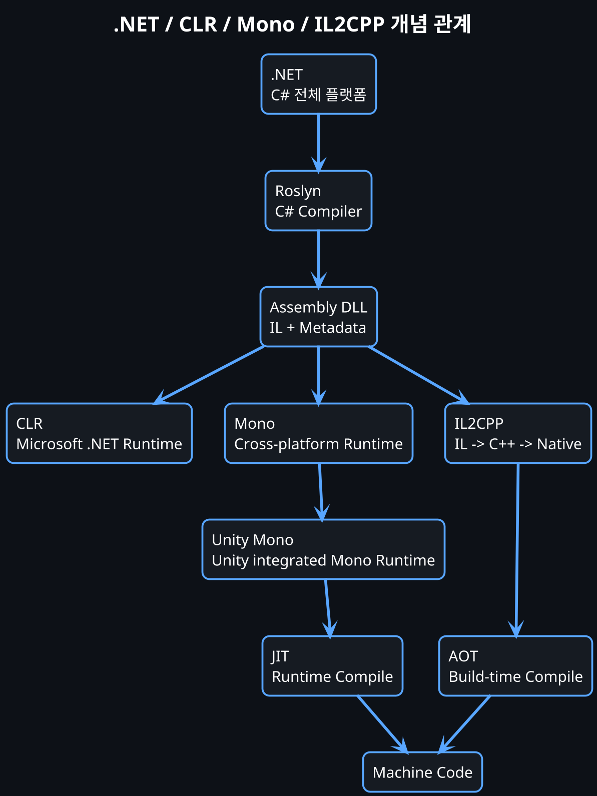
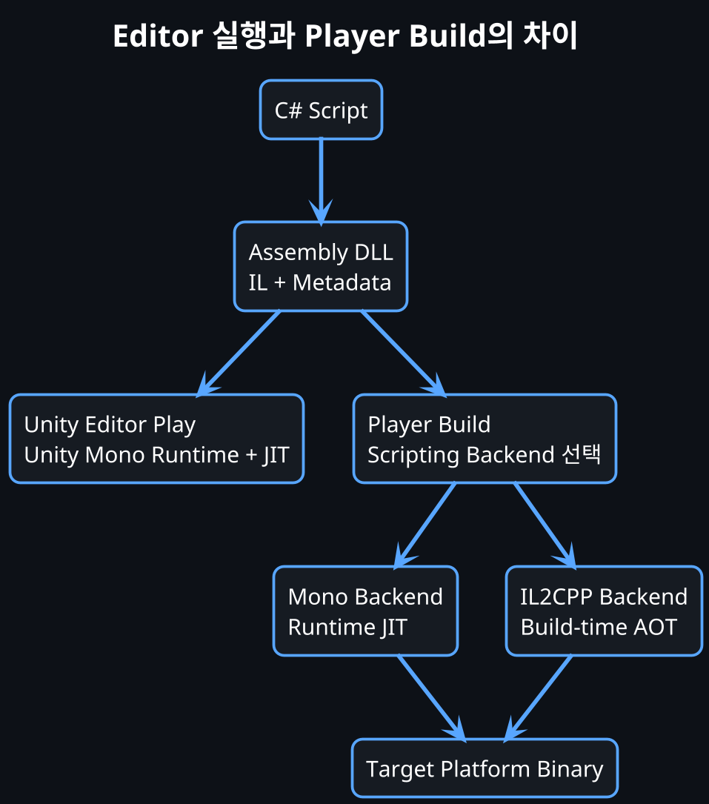
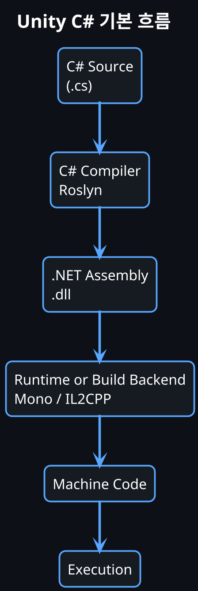
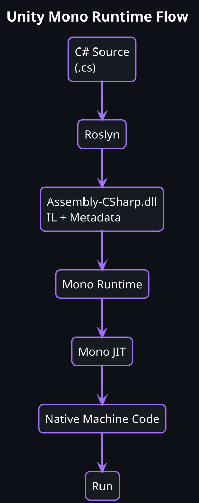
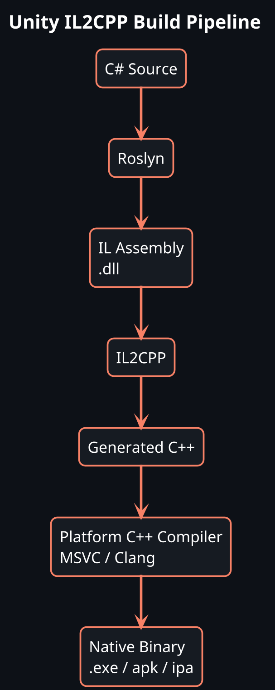
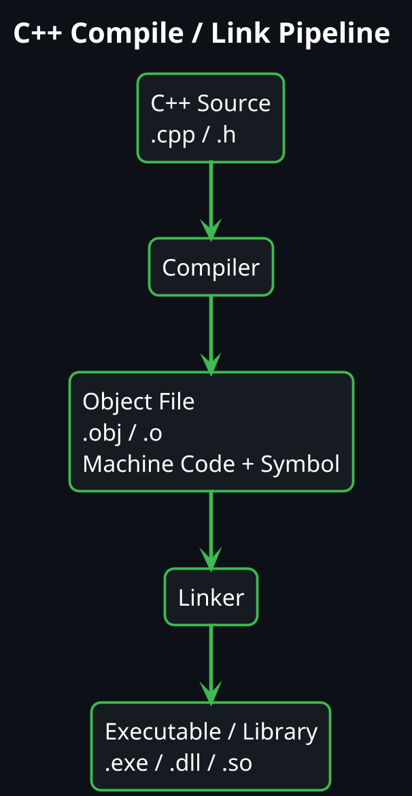
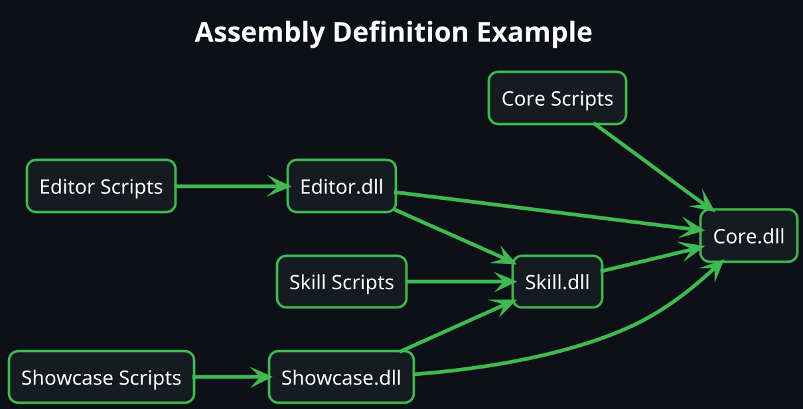
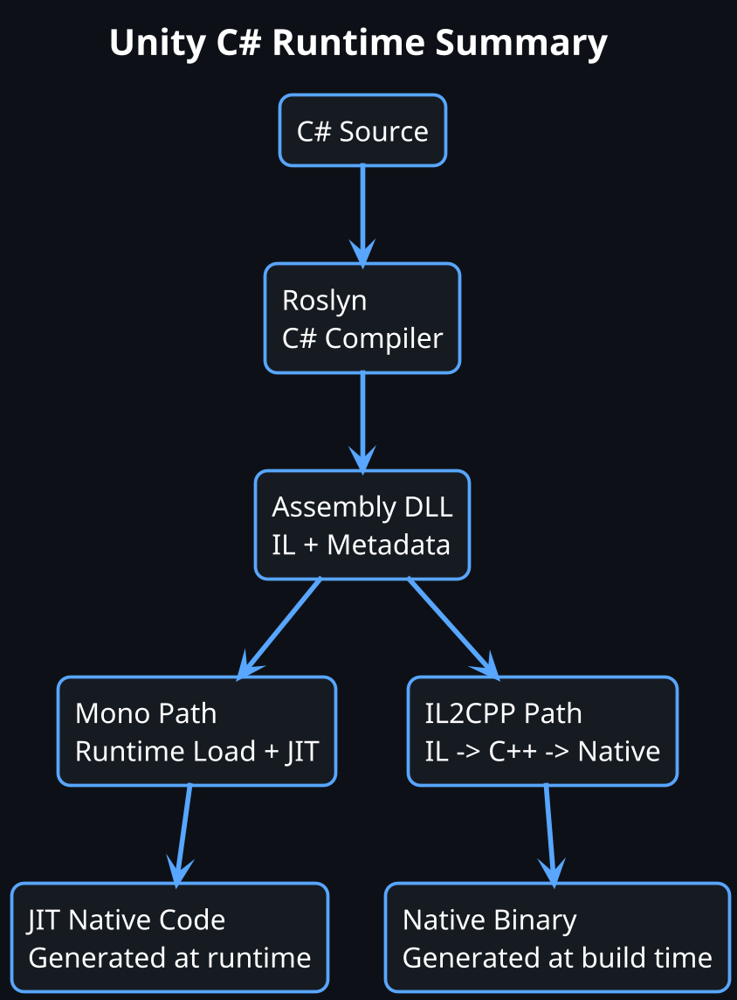

# Unity C# 컴파일 과정과 IL, Mono, IL2CPP, asmdef 이해하기

## 들어가며

Unity 프로젝트를 진행하다 보면 자연스럽게 `asmdef(Assembly Definition)`를 접하게 된다.

처음에는 asmdef를 단순히 "컴파일 시간을 줄여주는 기능" 정도로 생각하기 쉽다. 하지만 asmdef를 제대로 이해하려면 먼저 Unity가 C# 스크립트를 어떻게 컴파일하고 실행하는지 알아야 한다.

이 글에서는 아래 흐름을 정리한다.

- C# 코드는 누가 컴파일하는가
- `.NET`, `CLR`, `Mono`, `Unity Mono`는 각각 무엇인가
- `JIT`, `AOT`, `IL2CPP`는 무엇이 다른가
- `Assembly-CSharp.dll` 안에는 무엇이 들어있는가
- `IL`과 `Metadata`는 무엇인가
- `asmdef`는 왜 필요한가

핵심은 이것이다.

```text
C# 코드는 CPU가 바로 실행하지 않는다.
먼저 IL과 Metadata가 들어 있는 .NET Assembly로 컴파일되고,
런타임 또는 빌드 파이프라인이 그것을 실행 가능한 형태로 만든다.
```

---

# 1. 먼저 헷갈리는 용어부터 분리하기

이 주제에서 가장 헷갈리는 부분은 `.NET`, `CLR`, `Mono`, `Unity Mono`, `JIT`, `AOT`, `IL2CPP`가 서로 비슷한 위치에 있는 것처럼 보인다는 점이다.

하지만 기준을 나누면 훨씬 단순해진다.

```text
.NET        = C# 생태계 전체 플랫폼
CLR         = .NET 프로그램을 실행하는 런타임
Mono        = CLR과 비슷한 역할을 하는 크로스플랫폼 런타임 구현체
Unity Mono  = Unity에 통합된 Mono 기반 C# 실행 환경
JIT         = 실행 중 IL을 Native Code로 바꾸는 컴파일 방식
AOT         = 실행 전에 미리 Native Code로 바꾸는 컴파일 방식
IL2CPP      = Unity가 AOT를 수행하기 위해 만든 IL -> C++ 변환/빌드 파이프라인
asmdef      = Unity C# 스크립트를 여러 Assembly로 나누는 설정 파일
```

## .NET은 무엇인가

`.NET`은 C# 프로그램을 만들고 실행하기 위한 전체 플랫폼이다.

하나의 프로그램 이름이 아니라, C# 생태계 전체에 가깝다.

```text
.NET
├─ C# 언어
├─ Roslyn C# Compiler
├─ Base Class Library
├─ Runtime
│  ├─ CLR
│  ├─ GC
│  ├─ JIT
│  ├─ Exception Handling
│  ├─ Thread
│  └─ Reflection
├─ Assembly
├─ IL
└─ Metadata
```

게임 개발에 비유하면 이렇게 볼 수 있다.

```text
.NET = 게임 엔진 전체 생태계
CLR  = 엔진 런타임
C#   = 스크립트 언어
DLL  = 빌드된 스크립트 묶음
IL   = 런타임이 처리할 중간 코드
```

즉 `.NET`은 단순히 런타임 하나를 말하는 것이 아니다. C# 언어, 컴파일러, 표준 라이브러리, 런타임, 실행 모델을 포함한 전체 플랫폼이다.

## CLR은 무엇인가

`CLR`은 `Common Language Runtime`의 약자다.

C# 코드를 직접 실행하는 것이 아니라, C# 컴파일 결과물인 `Assembly DLL`을 로드하고 실행을 관리하는 런타임이다.

```text
C# Source
↓ Roslyn
IL + Metadata가 들어 있는 DLL
↓ CLR
JIT 또는 AOT 처리
↓
Machine Code 실행
```

CLR이 담당하는 일은 다음과 같다.

```text
CLR
├─ Assembly 로드
├─ Metadata 읽기
├─ Type 정보 구성
├─ Method Table 구성
├─ IL 검증
├─ JIT 컴파일
├─ GC 메모리 관리
├─ 예외 처리
├─ Reflection 지원
├─ Thread 관리
└─ Runtime Service 제공
```

여기서 중요한 점은 CLR이 단순한 "IL 실행기"가 아니라는 것이다.

C# 프로그램이 실행되는 동안 필요한 타입 시스템, 메모리 관리, 예외 처리, 리플렉션, JIT 컴파일을 관리하는 실행 환경이다.

## Mono는 무엇인가

`Mono`는 CLR과 같은 목적을 가진 다른 런타임 구현체다.

원래 Microsoft의 .NET 런타임은 Windows 중심이었다. 그런데 C#을 Linux, macOS, 모바일, 게임 엔진 같은 환경에서도 실행하고 싶었고, 이를 위해 등장한 크로스플랫폼 .NET 런타임 구현체가 Mono다.

```text
Microsoft CLR
= Microsoft .NET Runtime 구현체

Mono
= 크로스플랫폼 .NET Runtime 구현체
```

둘 다 목적은 비슷하다.

```text
IL + Metadata
↓
Runtime이 Assembly 로드
↓
JIT 또는 AOT
↓
Machine Code
```

다만 내부 구현과 지원 환경이 다르다.

## Unity Mono는 무엇인가

Unity에서 말하는 `Mono`는 보통 Unity가 엔진 내부에 통합한 Mono 기반 C# 런타임을 의미한다.

Unity Editor에서 C# 스크립트를 작성하고 실행하면 대략 이런 흐름이다.

```text
Player.cs
↓
Roslyn / C# Compiler
↓
Assembly-CSharp.dll
↓
Unity Mono Runtime
↓
Mono JIT
↓
Machine Code
↓
실행
```

주의할 점이 있다.

`MonoBehaviour`의 `Mono`와 `Mono Runtime`의 `Mono`는 같은 개념이 아니다.

```csharp
public class Player : MonoBehaviour
{
}
```

여기서 `MonoBehaviour`는 Unity 컴포넌트 시스템에서 사용하는 기반 클래스다.

반면 `Mono Runtime`은 C# 코드를 실행하는 런타임이다.

이름이 비슷해서 헷갈리지만, 아래처럼 구분하는 것이 좋다.

```text
MonoBehaviour = Unity Component 기반 클래스
Mono Runtime  = C# Assembly를 실행하는 런타임
Unity Mono    = Unity에 내장된 Mono 기반 스크립팅 실행 환경
```

## JIT와 AOT는 무엇인가

`JIT`와 `AOT`는 런타임 이름이 아니라 컴파일 방식이다.

```text
JIT = Just-In-Time
AOT = Ahead-Of-Time
```

JIT는 실행 중에 필요한 순간 IL을 Native Code로 바꾼다.

```text
첫 호출:
IL -> JIT -> Machine Code -> 실행

두 번째 호출:
이미 만들어진 Machine Code 실행
```

AOT는 실행 전에 미리 Native Code를 만들어둔다.

```text
빌드 시점:
IL -> Native Code

실행 시점:
Native Code 바로 실행
```

왜 AOT가 필요할까?

대표적인 이유는 iOS다. iOS는 보안 정책상 앱이 실행 중에 새로운 실행 코드를 생성하는 것을 강하게 제한한다. JIT는 런타임 중에 Machine Code를 생성하기 때문에 iOS 같은 환경에서는 문제가 된다.

그래서 Unity는 JIT 없이도 실행 가능한 AOT 방식이 필요했고, 그 대표적인 구현이 IL2CPP다.

## IL2CPP는 무엇인가

`IL2CPP`는 이름 그대로 `IL to C++`다.

Unity의 AOT 스크립팅 백엔드이며, C#을 바로 C++로 바꾸는 것이 아니라 C# 컴파일 결과물인 IL을 C++로 변환한다.

```text
C# Source
↓ Roslyn
IL Assembly
↓ IL2CPP
C++ Code
↓ MSVC / Clang
Native Binary
```

정확히 말하면 IL2CPP는 런타임 그 자체라기보다 Unity의 `IL -> C++ -> Native Code` 변환/빌드 파이프라인이다.

즉 이렇게 구분하면 된다.

```text
Mono   = 런타임
AOT    = 컴파일 방식
IL2CPP = Unity가 AOT를 수행하기 위한 변환/빌드 시스템
```

## 한 번에 보는 관계도



이 개념 지도를 머리에 두고 아래 내용을 보면 Mono, IL2CPP, AOT가 서로 겹쳐 보이지 않는다.

---

# 2. 개발 OS와 Scripting Backend는 별개다

여기서 한 가지를 더 분리해야 한다.

Unity를 `Windows에서 개발하는가`, `Mac에서 개발하는가`보다 더 중요한 것은 `Editor에서 실행하는가`, `빌드 결과물을 만드는가`, 그리고 `Scripting Backend를 무엇으로 설정했는가`이다.

잘못 이해하기 쉬운 방식은 다음이다.

```text
Windows에서 개발 = Mono + JIT
Mac에서 개발     = IL2CPP + AOT
```

이렇게 외우면 틀릴 가능성이 높다.

실제 기준은 다음에 가깝다.

```text
Unity Editor에서 Play
= 대부분 Unity Mono Runtime 기반 실행

실제 Player Build
= Target Platform + Scripting Backend 설정에 따라 결정
```

## Editor에서 Play할 때

Unity Editor에서 `Play` 버튼을 눌러 실행하는 상황을 보자.

개발 OS가 Windows든 macOS든, 일반적인 Editor 실행 흐름은 다음과 같다.

```text
C# Script
↓
Assembly-CSharp.dll 또는 asmdef Assembly
↓
Unity Mono Runtime
↓
Mono JIT
↓
Machine Code
↓
Editor 안에서 실행
```

즉 Mac에서 Unity를 실행한다고 해서 Editor 내부의 C# 스크립트가 자동으로 IL2CPP로 실행되는 것은 아니다.

Editor 환경에서는 빠른 반복 개발이 중요하다. 스크립트를 수정하고 저장하면 Unity가 다시 컴파일하고, Play 모드에서 Mono Runtime이 해당 Assembly를 로드해서 실행한다.

```text
스크립트 수정
↓
저장
↓
Unity Script Compilation
↓
Assembly 갱신
↓
Play
↓
Unity Mono Runtime에서 실행
```

## 빌드할 때

빌드할 때는 이야기가 달라진다.

빌드 결과물은 `Build Settings`와 `Player Settings`의 `Scripting Backend` 설정에 따라 달라진다.

Unity 공식 문서에서도 Scripting Backend는 C# 스크립트를 실행 가능한 명령으로 바꾸는 방식과 타겟 플랫폼에서 어떤 런타임이 관리하는지를 결정한다고 설명한다.

예를 들어 Windows 빌드라고 해서 반드시 Mono만 사용하는 것이 아니다.

```text
Windows Build
├─ Mono Backend 가능
└─ IL2CPP Backend 가능
```

macOS 빌드도 마찬가지다.

```text
macOS Build
├─ Mono Backend 가능
└─ IL2CPP Backend 가능
```

반면 iOS는 JIT 제한 때문에 IL2CPP가 사실상 필수라고 이해하면 된다.

```text
iOS Build
└─ IL2CPP Backend 필요
```

## Mono Backend로 빌드하면 어떻게 배포될까

Mono Backend를 사용하는 Player 빌드는 대략 다음 구조로 볼 수 있다.

```text
Game Executable
+
Unity Engine Native Code
+
Mono Runtime
+
Managed Assembly DLL
```

실행 흐름은 다음과 같다.

```text
Game 실행
↓
Unity Engine 실행
↓
Mono Runtime 초기화
↓
Assembly DLL 로드
↓
필요한 메서드 JIT 컴파일
↓
Machine Code 실행
```

즉 Mono Backend는 런타임에 IL을 JIT로 Native Code로 바꾼다.

## IL2CPP Backend로 빌드하면 어떻게 배포될까

IL2CPP Backend를 사용하면 빌드 시점에 C# Assembly의 IL이 C++ 코드로 변환된다.

```text
C# Script
↓
IL Assembly
↓
IL2CPP
↓
Generated C++ Code
↓
Platform C++ Compiler
↓
Native Binary
```

실행 시점에는 Mono JIT처럼 IL을 Native Code로 바꾸는 과정이 없다.

이미 빌드 시점에 플랫폼별 Native Code가 만들어졌기 때문이다.

```text
Game 실행
↓
Unity Engine 실행
↓
IL2CPP로 생성된 Native Code 실행
```



## 플랫폼별로 다시 정리

정확히는 아래처럼 보는 것이 좋다.

```text
Windows Editor
└─ 일반적으로 Unity Mono Runtime 기반 Play

macOS Editor
└─ 일반적으로 Unity Mono Runtime 기반 Play

Windows Build
├─ Mono Backend 가능
└─ IL2CPP Backend 가능

macOS Build
├─ Mono Backend 가능
└─ IL2CPP Backend 가능

Android Build
├─ Mono Backend 가능했던 환경도 있음
└─ 현재는 IL2CPP를 주로 사용하거나 권장하는 경우가 많음

iOS Build
└─ IL2CPP Backend 필요
```

따라서 핵심은 이것이다.

```text
개발 OS가 Mono/IL2CPP를 결정하는 것이 아니다.
Editor 실행인지, Player Build인지가 먼저 중요하고,
빌드에서는 Target Platform과 Scripting Backend 설정이 중요하다.
```

## Engine과 C# 코드의 관계

Unity 게임 실행 파일 전체를 볼 때도 구분이 필요하다.

Unity 엔진 자체는 네이티브 코드로 구현되어 있다. 우리가 작성한 C# 스크립트는 그 위에서 관리 코드로 실행되거나, IL2CPP를 통해 네이티브 코드로 변환되어 포함된다.

Mono Backend에서는 대략 이렇게 볼 수 있다.

```text
Unity Engine Native Code
+
Mono Runtime
+
C# Assembly DLL
```

IL2CPP Backend에서는 대략 이렇게 볼 수 있다.

```text
Unity Engine Native Code
+
IL2CPP로 변환된 Native Code
+
필요한 Metadata / Runtime Support
```

이렇게 보면 `개발할 때는 Mono`, `배포할 때는 타겟과 설정에 따라 Mono 또는 IL2CPP`라는 구조가 더 명확해진다.

---

# 3. Unity에서 C# 코드는 바로 실행되지 않는다

우리가 작성하는 코드는 `.cs` 파일이다.

```csharp
public class Player
{
    public int Hp = 100;

    public void Damage(int value)
    {
        Hp -= value;
    }
}
```

하지만 CPU는 C# 문법을 직접 실행하지 못한다.

CPU가 이해하는 것은 이런 형태의 기계어다.

```asm
mov eax, [rcx+4]
sub eax, edx
mov [rcx+4], eax
ret
```

따라서 Unity C# 코드는 아래 과정을 거쳐야 한다.



---

# 4. Roslyn은 무엇인가

Roslyn은 Microsoft의 C# 컴파일러 플랫폼이다.

Unity에서 C# 스크립트를 저장하면 Unity Editor가 변경을 감지하고 C# 컴파일러를 실행한다. 이때 C# 코드를 IL과 Metadata가 들어 있는 Assembly로 만드는 역할을 Roslyn이 담당한다.

Roslyn의 역할은 대략 이렇다.

```text
.cs 파일
↓
문법 검사
↓
타입 검사
↓
메서드 / 필드 / 클래스 바인딩
↓
일부 컴파일 최적화
↓
IL 생성
↓
Metadata 생성
↓
Assembly DLL 생성
```

예를 들어 Unity 기본 프로젝트에서 asmdef가 없다면 대부분의 스크립트는 하나의 DLL로 묶인다.

```text
Player.cs
Enemy.cs
Skill.cs
UIManager.cs
↓
Assembly-CSharp.dll
```

여기서 중요한 점은 `Assembly-CSharp.dll`이 C++의 Native DLL과 같지 않다는 것이다.

C# DLL은 일반적으로 CPU가 바로 실행할 기계어를 담고 있는 것이 아니라, IL 코드와 Metadata를 담고 있는 .NET Assembly다.

---

# 5. DLL 안에는 무엇이 들어있나

C# 컴파일 결과물인 DLL 안에는 크게 두 가지가 들어 있다.

```text
Assembly-CSharp.dll
├─ IL Code
└─ Metadata
```

## IL Code

IL은 Intermediate Language의 약자다.

C#과 Machine Code 사이에 있는 중간 언어라고 보면 된다.

예를 들어 이 C# 코드가 있다고 하자.

```csharp
public void Damage(int value)
{
    Hp -= value;
}
```

개념적으로 IL은 이런 식에 가깝다.

```il
ldarg.0
ldfld Player::Hp
ldarg.1
sub
stfld Player::Hp
ret
```

이 코드는 CPU가 직접 실행하는 x64 명령어가 아니다.

아직 런타임이 해석하거나 JIT/AOT를 통해 Native Code로 바꿔야 하는 중간 코드다.

## Metadata

Metadata는 DLL 안에 들어 있는 타입 정보다.

예를 들어 아래 C# 코드가 있다.

```csharp
public class Player
{
    public int Hp;
    public void Damage(int value) { }
}
```

Metadata에는 개념적으로 이런 정보가 저장된다.

```text
Class: Player
Field:
  Name: Hp
  Type: int
Method:
  Name: Damage
  Parameter: int value
```

이 Metadata가 있기 때문에 런타임은 다음과 같은 작업을 할 수 있다.

```csharp
typeof(Player)
    .GetField("Hp")
    .GetValue(player);
```

즉 Reflection은 Metadata를 기반으로 동작한다.

정리하면 이렇게 볼 수 있다.

```text
IL       = 실행될 코드의 중간 표현
Metadata = 타입과 멤버에 대한 설계도
```

---

# 6. CLR은 무엇인가

CLR은 Common Language Runtime의 약자다.

쉽게 말하면 .NET 프로그램을 실행하는 런타임 환경이다.

Roslyn과 CLR을 구분해야 한다.

```text
Roslyn = 컴파일러
CLR    = 런타임
```

비유하면 다음과 같다.

```text
Roslyn = C#을 IL로 번역하는 번역가
CLR    = IL Assembly를 메모리에 올리고 실행을 관리하는 운영체제 같은 관리자
```

CLR이 담당하는 일은 많다.

- Assembly 로드
- Metadata 읽기
- Type 정보 구성
- Method Table 구성
- JIT 컴파일
- GC
- 예외 처리
- Thread 관리
- Reflection
- 보안 / Runtime Check

즉 CLR은 단순히 "IL을 실행하는 것"만 하는 존재가 아니다.

.NET 프로그램이 실행되는 환경 전체를 관리한다.

---

# 7. Mono는 무엇인가

Mono는 .NET 런타임 구현체 중 하나다.

Unity는 오랫동안 Mono 런타임을 사용해왔다. Unity Editor에서 C# 스크립트를 실행할 때는 보통 Mono Runtime이 Assembly-CSharp.dll을 로드하고 JIT를 통해 코드를 실행한다.

중요한 관계는 이렇다.

```text
CLR = .NET 런타임 개념 / Microsoft .NET의 런타임
Mono = CLR과 유사한 역할을 하는 런타임 구현체
Unity Mono = Unity에서 사용하는 Mono 기반 스크립팅 런타임
```

즉 모든 Mono가 Unity는 아니고, Unity는 Mono를 자신의 엔진 환경에 맞게 통합해 사용한다고 이해하면 된다.

Unity Editor에서 Mono 기반 실행 흐름은 다음과 같다.



---

# 8. 프로그램 시작 시 모든 코드가 바로 컴파일될까

아니다.

Mono JIT 방식에서는 보통 프로그램 시작 시 모든 메서드가 한 번에 Native Code로 바뀌는 것이 아니다.

예를 들어 프로그램이 시작되면 런타임은 먼저 Assembly를 로드한다.

```text
1. Assembly-CSharp.dll 로드
2. Metadata 읽기
3. Player 클래스 발견
4. Type 정보 구성
5. Method Table 구성
6. 객체 생성 준비
```

이 시점에는 아직 `Damage()` 메서드의 Native Code가 없을 수 있다.

실제로 메서드가 처음 호출될 때 JIT가 동작한다.

```csharp
player.Damage(10);
```

런타임 입장에서는 이렇게 된다.

```text
Damage() 호출 요청
↓
Damage()의 Native Code가 있는지 확인
↓
없음
↓
JIT Compiler 호출
↓
Damage() IL을 Native Code로 변환
↓
변환된 Native Code 주소를 Method Table에 연결
↓
Native Code 실행
```

두 번째 호출부터는 이미 만들어진 Native Code를 바로 실행한다.

```text
첫 호출  : IL -> JIT -> Native Code -> 실행
두 번째  : Native Code -> 실행
세 번째  : Native Code -> 실행
```

그래서 "IL을 실행한다"는 표현은 정확히는 단순화된 표현이다.

실행 중 실제 CPU가 처리하는 것은 JIT가 만들어낸 Native Machine Code다.

---

# 9. JIT를 구체적인 예시로 보기

다시 이 코드를 보자.

```csharp
public void Damage(int value)
{
    Hp -= value;
}
```

C# 컴파일러는 이 코드를 IL로 바꾼다.

```il
ldarg.0
ldfld Player::Hp
ldarg.1
sub
stfld Player::Hp
ret
```

그리고 런타임 중 이 메서드가 처음 호출되면 JIT가 플랫폼에 맞는 기계어를 만든다.

예를 들어 x64에서는 개념적으로 이런 코드가 될 수 있다.

```asm
mov eax, [rcx+4]
sub eax, edx
mov [rcx+4], eax
ret
```

이 Native Code는 런타임 내부의 메모리에 저장된다.

```text
Native Code Memory
0x7FF123400000:
  mov eax, [rcx+4]
  sub eax, edx
  mov [rcx+4], eax
  ret
```

그 다음부터는 `Damage()`를 호출할 때마다 이 Native Code 주소로 점프한다.

즉 런타임 중에는 아래 세 공간을 구분해야 한다.

```text
DLL 파일 안:
  IL
  Metadata

Runtime 메모리 안:
  Type 정보
  Method Table
  JIT Native Code

CPU가 실제 실행:
  Native Machine Code
```

---

# 10. IL2CPP는 무엇인가

IL2CPP는 Intermediate Language To C++의 약자다.

Unity가 제공하는 스크립팅 백엔드 중 하나이며, Unity 공식 문서 기준으로 IL2CPP는 C# IL을 C++로 변환한 뒤 네이티브 코드로 컴파일하는 AOT 방식의 파이프라인이다.

Mono JIT와 가장 큰 차이는 "언제 Native Code를 만드느냐"다.

```text
Mono JIT:
실행 중에 IL을 Native Code로 변환

IL2CPP:
빌드 시점에 IL을 C++로 변환하고 Native Binary로 컴파일
```

IL2CPP 빌드 흐름은 다음과 같다.



중요한 점은 C# 소스 코드가 바로 C++ 소스 코드로 바뀌는 것이 아니라는 점이다.

반드시 중간에 IL Assembly가 있다.

```text
C#
↓
IL
↓
C++
↓
Native Binary
```

그래서 IL2CPP는 "C#을 C++처럼 작성한다"는 뜻이 아니다.

C# 컴파일 결과물인 IL을 C++로 변환해서 플랫폼별 네이티브 바이너리를 만드는 Unity 빌드 백엔드다.

---

# 11. Mono와 IL2CPP 비교

| 구분 | Mono | IL2CPP |
|---|---|---|
| 방식 | JIT 중심 | AOT 중심 |
| Native Code 생성 시점 | 실행 중 | 빌드 중 |
| 빌드 시간 | 상대적으로 짧음 | 상대적으로 김 |
| 실행 중 JIT 비용 | 있음 | 없음 |
| iOS 대응 | JIT 제한 때문에 부적합 | 적합 / 필요 |
| 디버깅 | Editor 개발에 편함 | 빌드 결과 중심 |
| 코드 보호 | 상대적으로 약함 | 상대적으로 강함 |
| Reflection | Metadata 기반 가능 | 코드 스트리핑 주의 필요 |

한 줄로 정리하면 다음과 같다.

```text
Mono는 개발 중 빠른 반복에 유리하고,
IL2CPP는 배포 빌드와 플랫폼 대응에 유리하다.
```

---

# 12. C++ 컴파일과 C# 컴파일의 차이

C++은 일반적으로 소스 코드가 플랫폼별 Object File로 컴파일되고, Linker가 실행 파일이나 라이브러리로 묶는다.



반면 C#은 먼저 IL과 Metadata가 들어 있는 Assembly를 만든다.

```text
C++:
Source -> Object File -> Native Binary

C#:
Source -> IL Assembly -> Runtime 또는 IL2CPP -> Native Code
```

그래서 `Assembly`라는 단어가 헷갈릴 수 있다.

C++에서 Assembly라고 하면 보통 CPU 명령어에 가까운 어셈블리어를 떠올리지만, C#에서 Assembly는 `.NET Assembly`, 즉 IL과 Metadata를 담은 배포/컴파일 단위에 가깝다.

---

# 13. asmdef는 여기서 왜 등장하는가

Unity에서 asmdef가 없으면 대부분의 사용자 스크립트는 `Assembly-CSharp.dll`에 들어간다.

```text
Player.cs
Enemy.cs
Skill.cs
UIManager.cs
EditorTool.cs
↓
Assembly-CSharp.dll
```

프로젝트가 작을 때는 문제가 적다.

하지만 프로젝트가 커지면 문제가 생긴다.

- 코드 하나 수정해도 큰 Assembly가 다시 컴파일된다.
- Runtime 코드와 Editor 코드가 섞인다.
- 기반 코드가 상위 기능 코드를 참조하는 식으로 의존성이 꼬일 수 있다.
- 모듈 단위 설계가 코드 구조에 드러나지 않는다.

asmdef는 스크립트를 여러 Assembly로 나누는 기능이다.

Unity 공식 문서에서도 Assembly는 코드와 리소스를 묶는 컴파일 단위이며, 스크립트를 Assembly로 나누면 의존성 관리와 불필요한 재컴파일 감소에 도움이 된다고 설명한다.

예를 들면 이렇게 나눌 수 있다.



좋은 참조 방향은 다음과 같다.

```text
Core
↑
Runtime
↑
Modules
↑
Showcase

Editor -> Core, Runtime, Modules
```

나쁜 방향은 다음이다.

```text
Core -> Skill
Core -> Editor
Runtime -> Editor
```

기반 계층은 상위 기능을 몰라야 한다.

---

# 14. asmdef를 사용할 때 주의할 점

asmdef를 사용할 때는 이름을 예쁘게 나누는 것보다 참조 방향을 관리하는 것이 더 중요하다.

예를 들어 Editor 코드는 반드시 Editor 전용 Assembly로 분리하는 것이 좋다.

```csharp
using UnityEditor;

public class SkillEditorWindow : EditorWindow
{
}
```

이런 코드는 실제 게임 빌드에 포함되면 안 된다.

따라서 Editor용 asmdef는 `Include Platforms`를 `Editor`로 제한해야 한다.

또한 기반 Assembly는 상위 Assembly를 참조하지 않게 해야 한다.

```text
좋은 구조:
Skill.dll -> Core.dll

나쁜 구조:
Core.dll -> Skill.dll
```

이 규칙을 지키면 프로젝트가 커져도 컴파일 경계와 의존성 방향을 비교적 명확하게 유지할 수 있다.

---

# 15. 전체 흐름 다시 정리



핵심은 다음이다.

```text
1. Roslyn이 C# 코드를 컴파일하여 Assembly DLL을 만든다.
2. DLL에는 IL Code와 Metadata가 들어 있다.
3. Metadata는 타입, 필드, 메서드 정보를 담는다.
4. Mono Runtime은 Assembly를 로드하고 Metadata를 기반으로 타입 시스템을 구성한다.
5. Mono JIT는 메서드가 처음 호출될 때 IL을 Native Code로 바꾼다.
6. 이후에는 IL이 아니라 JIT가 만든 Native Code가 실행된다.
7. IL2CPP는 실행 중 JIT 대신 빌드 시 IL -> C++ -> Native Code로 변환한다.
8. asmdef는 Unity 스크립트 Assembly의 경계를 직접 나누는 기능이다.
```

---

# 16. 마무리

Unity에서 C# 코드는 작성한 그대로 CPU에서 실행되지 않는다.

먼저 Roslyn이 C# 코드를 컴파일하여 IL과 Metadata가 들어 있는 Assembly DLL을 만든다. 이 DLL은 런타임 또는 빌드 백엔드에 의해 실제 실행 가능한 형태로 바뀐다.

Mono 백엔드에서는 Unity Mono Runtime이 Assembly를 로드하고, 필요한 메서드가 처음 호출될 때 JIT가 IL을 Native Code로 변환한다.

IL2CPP 백엔드에서는 빌드 시점에 IL을 C++ 코드로 변환하고, 플랫폼 C++ 컴파일러가 최종 Native Binary를 생성한다. 이 방식은 AOT에 가깝기 때문에 iOS처럼 JIT가 제한되는 플랫폼에서 중요하다.

asmdef는 이 흐름에서 Unity 스크립트를 여러 Assembly로 나누는 도구다. 단순히 컴파일 시간을 줄이기 위한 기능이 아니라, 프로젝트의 컴파일 경계와 의존성 방향을 관리하는 수단으로 보는 것이 좋다.

---

# 17. 참고 문서

- Unity Manual - Scripting back ends: https://docs.unity3d.com/Manual/scripting-backends.html
- Unity Manual - IL2CPP scripting back end: https://docs.unity3d.com/Manual/IL2CPP.html
- Unity Manual - Organizing scripts into assemblies: https://docs.unity3d.com/Manual/assembly-definition-files.html

